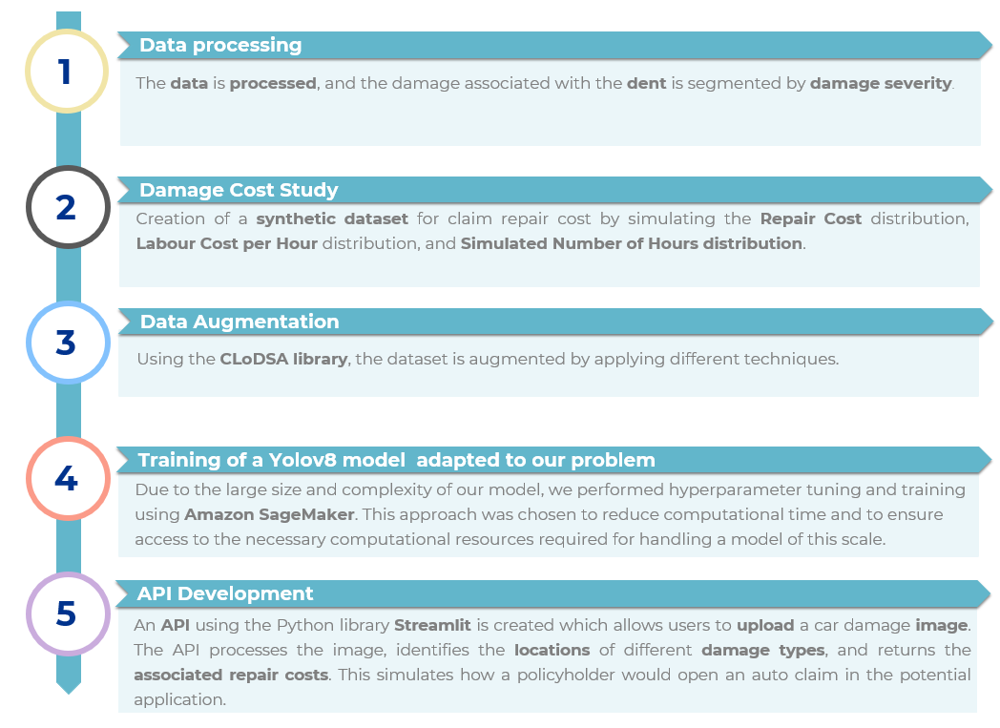
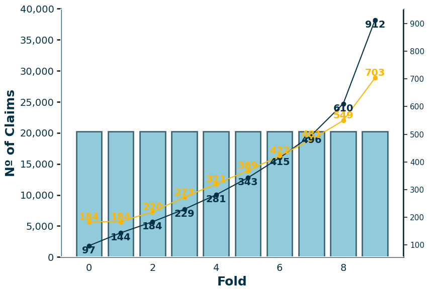
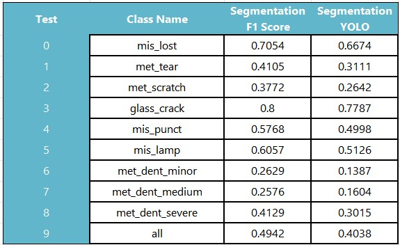
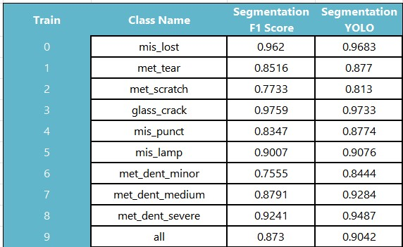

# <span style="color:#5fa8d3;">Insurance auto claim damage and severity detection for cars</span>

    

## Table of Contents

<p>
<span style="color:#fb8500;">1.</span> <a href="#about">About</a><br>
<span style="color:#fb8500;">2.</span> <a href="#example">Example</a><br>
<span style="color:#fb8500;">3.</span> <a href="#workflow">Workflow</a><br>
<span style="color:#fb8500;">4.</span> <a href="#structure">Project structure</a><br>
<span style="color:#fb8500;">5.</span> <a href="#deployment">Deployment of the project</a><br>
&nbsp;&nbsp;&nbsp;&nbsp;<span style="color:#fb8500;">5.1.</span> <a href="#local">Local</a><br>
&nbsp;&nbsp;&nbsp;&nbsp;<span style="color:#fb8500;">5.2.</span> <a href="#aws">Amazon Web Services</a><br>
<span style="color:#fb8500;">6.</span> <a href="#models"> Models</a><br>
<span style="color:#fb8500;">7.</span> <a href="#results"> Results</a><br>
<span style="color:#fb8500;">8.</span> <a href="#conclusions"> Conclusions</a><br>
</p>

## <span id="about" style="color:#5fa8d3;">1. About</span>

This project enhances the **car insurance claims** process by leveraging machine learning to create an end-to-end solution that detects, localizes, and estimates the severity of **car damages** using deep learning techniques. It includes a **YOLOv8 model** retrained with data from the [Vehide Dataset](https://www.kaggle.com/datasets/hendrichscullen/vehide-dataset-automatic-vehicle-damage-detection/data) to accurately identify and locate various car damages, a **cost estimation model** obtained from simulated data using **Monte Carlo** methods, and a user-friendly **AutoClaim web application** where clients can upload photos of their damaged vehicles, receive repair cost estimates, and be directed to an appropriate workshop for repairs.


## <span id="example" style="color:#5fa8d3;">2. Example</span>

Below is an example of how the application and the outputs would appear when a client of the insurance company uploads a car damage.

<p align="center">
  
</p>

## <span id="workflow" style="color:#5fa8d3;">3. Workflow</span>
<p align="center">
  
</p>


## <span id="structure" style="color:#5fa8d3;">4. Project Structure</span>
The project is organized into the following main directories:

- [**/API/**](./API/): Contains the *Python* scripts and images used to construct the Autoclaim application using Streamlit.
  - [**/Icons/**](./API/Icons/): Folder for the images used in the construction of the application.
  - [**/pages/**](./API/pages/): Folder containing the Python scripts for each of the secondary pages of the API.
    - [*1_Policy Details.py*](./API/pages/1_Policy%20Details.py): Python script for displaying the details of the client.
    - [*2_File Claim.py*](./API/pages/2_File%20Claim.py): Python script for opening a claim.
    - [*3_Upload Damage.py*](./API/pages/3_Upload%20Damage.py): Python script for uploading images of the damage.
    - [*4_Final View.py*](./API/pages/4_Final%20View.py): Python script for displaying the prediction of the damage and the assignment of the nearest workshop.
  - [**/uploads/**](API/uploads/): Folder where the uploaded and predicted images are saved.
  - [*Homepage.py*](./API/Homepage.py): Python script that serves as the main program for running the web application.
  - [*requirements.txt*](./API/requirements.txt): Text file with the requirements needed for converting the local Streamlit application to a cloud Streamlit application.

- [**/Data/**](./Data/): Contains the datasets and the COCO format JSON files used in the project (the JSON files ending with *updated* are the ones used throughout the entire project).
  - [**/train/**](./Data/train/): Folder with the *train* and *validation* datasets. It also saves the augmented photos when *[3_data_augmentation.ipynb](./Notebooks/3_data_augmentation.ipynb)* is run.
  - [**/test/**](./Data/test/): Folder with the test photos.
  - [**/Yoloimages/**](./Data/Yoloimages/): Folder, generated when *[4_yolo_code.ipynb](./Notebooks/4_yolo_code.ipynb)* is executed, containing the datasets prepared for the YOLO model. Each folder contains an *images* folder with the images and a *labels* folder with the *.txt* files containing annotations for each damage.
    - [**/train/**](./Data/Yoloimages/train): Directory containing the training set, including both original and augmented data.
    - [**/val/**](./Data/Yoloimages/val): Directory containing the validation set, used to tune the model's hyperparameters and evaluate performance during training.
    - [**/test/**](./Data/Yoloimages/test): Directory containing the test set, used to assess the model's generalization capability on unseen data.

- [**/Models/**](./Models/): Folder containing the cost model [*cost_model.pkl*](./Models/cost_model.pkl) and the car detection models.
  - [**/best_modeltuning_Yolo-tuning24/**](./Models/best_modeltuning_Yolo-tuning24/): Folder with the results of the best model obtained in the Hyperparameter tuning.
    - [**/train/**](./Models/best_modeltuning_Yolo-tuning24/train/): Folder with the output of the training process.
    - [**/val/**](./Models/best_modeltuning_Yolo-tuning24/val/): Folder with the output of the validation process.
  - [**/yolo_weights/**](./Models/yolo_weights/): Folder with the original weights of the YOLOv8 segmentation problem.
  - [**/YOLO-final4/**](./Models/YOLO-final4/): Folder with the results of the chosen model and trained with the validation and train sets.
    - [**/train/**](./Models/YOLO-final4/train/): Folder with the output of the training process.
    - [**/test/**](./Models/YOLO-final4/test/): Folder with the output of the test process.
    - [**/test/**](./Models/YOLO-final4/train_final_metrics/): Folder with the output of the metrics of the whole train set for comparing with the test results.
    - *cost_model.pkl.part-\**: Fragments of the cost_model that the model had to be splitted to be able to uploaded in Github. There are to options to obtain the model: by joining all this parts or running the training of the model that it does not take too much time.
    - [*yolo_model.pt*](./Models/yolo_model.pt): Weights of the final model for detecting car damages.
- [**/Notebooks/**](./Notebooks/): Jupyter notebooks used for the project.
  - *[0_linux_requirements.ipynb](./Notebooks/0_linux_requirements.ipynb)*: Jupyter notebook for installing the requirements defined for SageMaker.
  - [*1_data_processing.ipynb*](./Notebooks/1_data_processing.ipynb): Jupyter notebook for data processing.
  - [*2_Claim_costs.ipynb*](./Notebooks/2_Claim_costs.ipynb): Jupyter notebook explaining how the auto claim data is generated and the model obtained for predicting car damage repair costs.
  - [*3_data_augmentation.ipynb*](./Notebooks/3_data_augmentation.ipynb): Jupyter notebook applying the data augmentation to the data train and merging the new data with the train data.
  - [*4_yolo_code.ipynb*](./Notebooks/4_yolo_code.ipynb): Code for preparing the data for the YOLO model, migrating the data to Amazon S3, and tuning the hyperparameters and training the YOLO model in Amazon SageMaker.
  - [*98_model_predictions.ipynb*](./Notebooks/98_model_predictions.ipynb): Jupyter notebook for checking the predictions of the cost estimation model.
  - [*99_check_photos.ipynb*](./Notebooks/99_check_photos.ipynb): Jupyter notebook for plotting the photos and their corresponding damage polygons.
  - [*data.yaml*](./Notebooks/data.yaml), [*data_test.yaml*](./Notebooks/data_test.yaml), [*data_train_final.yaml*](./Notebooks/data_train_final.yaml), [*data_tune_metrics.yaml*](./Notebooks/data_tune_metrics.yaml), [*data_train_final_metrics.yaml*](./Notebooks/data_train_final_metrics.yaml): YAML files for specifying the validation and training datasets for the YOLO models depending on the context (for training or validating the data).

- [**/Sagemaker/**](./Sagemaker/): Folder containing the two Python programs ([train_tune.py](./Sagemaker/train_tune.py) and [train_final.py](./Sagemaker/train_final.py)) with the code for defining the models to train in Amazon SageMaker.

- [**/src/**](./src/): Folder containing the [*mymodule.py*](./src/mymodule.py) script with all the functions used in the project, each containing an explanation of their purpose, inputs, and outputs.

- [**/Others/**](./Others/): Folder with various files that were useful during the project (e.g., Git steps for every time SageMaker was opened, relevant links, tips, etc.).

- [**/images_readme/**](./images_readme/): Folder with the images used to generate this README.

- [*requirements.txt*](./requirements.txt): File listing all the dependencies needed to run the project locally.
- [*requirements_linux.txt*](./requirements_linux.txt): File listing all the dependencies needed to run the project in Amazon SageMaker.
- [*config.yaml*](./config.yaml): YAML file defining the variables used throughout the project.


##  <span id="deployment" style="color:#5fa8d3;">5. Deployment of the project</span>
Our work is divided into two main parts: one that can be executed locally and another that, due to the high computational power required by YOLOv8, has been migrated to Amazon SageMaker. In the local environment, tasks such as data preparation and processing, model evaluation, and small-scale experiments can be performed. However, training and hyperparameter optimization, which demand significant computational resources, are carried out on Amazon SageMaker. Below, we explain in detail the activities that can be performed in each environment.

All codes of [**/Notebooks/**](./Notebooks/) are run from the main directory and this is done by executing this code at the beginning of all the Jupyter Noteboks:

````python
current_directory = os.getcwd()
last_folder = os.path.basename(current_directory)
    
if last_folder != "project-danielteresa":
    while last_folder != "project-danielteresa":
        parent_directory = os.path.dirname(current_directory)
        last_folder = os.path.basename(parent_directory)

        os.chdir(parent_directory)
        print(f"Changed directory to: {parent_directory}")
else:
    print("Already in the project root directory.")
````

###  <span id="local" style="color:#5fa8d3;">5.1 Local</span>
The parts of the project that can be computed locally are:
- [*1_data_processing.ipynb*](./Notebooks/1_data_processing.ipynb)
- [*2_Claim_costs.ipynb*](./Notebooks/2_Claim_costs.ipynb)
- [*3_data_augmentation.ipynb*](./Notebooks/3_data_augmentation.ipynb).
- The application of [**/API/**](./API/)

This part of the project has been executed with [Python 3.11]() and [Python 3.12.4](https://www.python.org/downloads/release/python-3124/).

It is a good practice to create an environment for working on projects like this one. After creating the environment and once it is activated, the following command should be run in the terminal inside the main folder of the project (assuming it is a Python environment):

````bash
pip install requirements.txt
````
- [*1_data_processing.ipynb*](./Notebooks/1_data_processing.ipynb): This Jupyter Notebook converts the [VGG annotation format](https://roboflow.com/formats/via-json) provided by Kaggle to [COCO format annotations](https://haobin-tan.netlify.app/ai/computer-vision/object-detection/coco-dataset-format/). Additionally, it segments the `met_dent` by severity for test and train datasets and splits the original train data into validation and train sets. **⚠️ CAUTION: NOT RECOMMENDED TO RUN! ⚠️**  
  **Why?** Breaking down the data into three severity labels requires manually labeling **4,709 annotations** for the train set and **972 annotations** for the test set—an extremely time-consuming task. The updated JSON files are in COCO format with the correct annotations in [**/Data/**](./Data/).

- [*2_Claim_costs.ipynb*](./Notebooks/2_Claim_costs.ipynb): This Jupyter Notebook can be run locally and includes a detailed explanation of how the data is simulated.

- [*3_data_augmentation.ipynb*](./Notebooks/3_data_augmentation.ipynb): This notebook will create augmented data using the [CLoDSA](https://bmcbioinformatics.biomedcentral.com/articles/10.1186/s12859-019-2931-1) library. **Note:** This process takes around an 30/40 minutes.

- [**/API/**](./API/): This folder contains all the necessary files for constructing the application. [Streamlit](https://streamlit.io/) is a library that allows converting Python scripts to web pages in a simple way. To open the web page locally, run the following command from the main directory:
  
  ````bash
  streamlit run API/Homepage.py
  ````
  It will open the web page automatically, but a link will also be provided in the terminal for accessing the web page if needed. The web page will remain active until the process of running the program finishes (`Ctrl + C`). This code needs the cost model and the weights of the best model.

  The cost model can be obtained by running again the final training or by joining the parts of the model:
  ````bash
  cat Models/yolo_model.pkl.part-* > Models/yolo_model.pkl
  ````


###  <span id="aws" style="color:#5fa8d3;">5.2 Amazon Web Services</span>

The AWS services primarily used are [S3](https://aws.amazon.com/s3/?nc=sn&loc=0), a scalable object storage service, and [Amazon SageMaker](https://aws.amazon.com/s3/?nc=sn&loc=0), a fully managed service that enables the building, training, and deployment of machine learning models at scale. The  [*4_yolo_code.ipynb*](./Notebooks/4_yolo_code.ipynb) program need to be run from Amazon Sagemaker Studio becuase although it could be run locally with the respective Amazon credentials it needs computational power for some actions like connecting to the train characteristic of Amazon Sagemaker. 

For the part of Hyperparameter tuning it is used the HyperparameterTuner class from Amazon SageMaker which  is a powerful tool that automates the process of hyperparameter optimization for machine learning models. It works by launching multiple training jobs with different hyperparameter configurations, evaluating their performance based on a specified objective metric, and identifying the best configuration. To apply this for YOLOv8, it is necessary to create a [Sagemaker estimator](https://docs.aws.amazon.com/sagemaker/latest/dg/docker-containers-adapt-your-own-private-registry-estimator.html) representing the YOLOv8 model, define the hyperparameters you want to tune and specify the range of values to explore. Then, it is set up  HyperparameterTuner by passing the estimator, the objective metric, and the hyperparameter ranges, and finally run the tuning job using the tuner.fit() method. For a detailed example of hyperparameter tuning a YOLOv8 model with Amazon SageMaker, you can check out this [tutorial](https://baysconsulting.co.uk/hyperparameter-tuning-a-yolov8-model-with-amazon-sagemaker/).

We have decided to use the **ml.p3.2xlarge** instance because it is optimized for machine learning tasks that require high computational power. The ml.p3.2xlarge instance features NVIDIA Tesla V100 GPUs, which provide excellent performance for training deep learning models like YOLOv8.

In case of  having an user in AWS, what it should be done is:
  - Generate a Jupyter lab in Amazon Sagemaker. The properties of storage 100 GB and instance m7i.8xlarge:
  - Then, clone the repo by copying the link of this project in the terminal of the lab
  ````bash
  git clone <repository_url>
  ````  
  - This Juppyter Notebook that it is generated works with Python 3.8 and it has not any library  so *[0_linux_requirements.ipynb](./Notebooks/0_linux_requirements.ipynb)* needs to be run to installed all dependencies.
   -  [*3_data_augmentation.ipynb*](./Notebooks/3_data_augmentation.ipynb) needs to be run if the data is not yet uploaded in S3 for obtaining the train augmentation set locally in Sagemaker Studio and uploading it in S3. The new data is created by using the [CLoDSA](https://bmcbioinformatics.biomedcentral.com/articles/10.1186/s12859-019-2931-1) library. **Note:** This process takes around an hour.


  - Run [*4_yolo_code.ipynb*](./Notebooks/4_yolo_code.ipynb) and do not forget to add the credentials where `# ADD HERE CREDENTIALS` comment appears.
  - Once all the changes are being made and if it is wanted to upload the changes it is necessary first to create a *.gitignore* and then run the following line in terminal:
  ````bash
  cd project-danielteresa
  git config --global credential.helper store
  git config --global user.email <email>
  git config --global user.name <user name>
  git credential-cache exit
  git remote set-url origin https://<user name>:<token password>@github.com/ACM40960/project-danielteresa.git
  ````

##  <span id="models" style="color:#5fa8d3;">6. Models</span>

Our project addresses two estimation problems. One is predicting the repair cost for each of the damages sustained by the car, and the other is accurately locating and classifying the type of damage to generate a repair estimate. To achieve this, we have employed two models:
- **Random Forest** . It has been tried different prediction models, such as XG Boost, GLM Models with and withoun regularization and Random Forests with different parameters.

- **YOLO** is a state-of-the-art, real-time object detection algorithm that treats object detection as a regression problem instead of a classification task by spatially separating bounding boxes and associating probabilities with each detected object using a single convolutional neural network (CNN). The version used in this project is YOLOv8 in the "medium" size. Please refer to the PDF [YOLO_model.pdf](./Others/YOLO_model.pdf) that we have created to explain this model in detail if you want to dive deeper into how it works.

##  <span id="results" style="color:#5fa8d3;">7. Results</span>

The model was trained using all available predictors to simulate the claim dataset. Despite showing signs of underfitting, as seen in the [figure below](#xgboost-image), the approach is still more effective than the traditional methods used by insurance companies. The chart divides the test predictions from highest to lowest into groups and represents the actual and predicted averages for each of these groups (with the yellow line indicating the predicted mean cost and the blue line indicating the observed mean cost).


<p align="center" id="costmodel-image">
  
</p>

Below are the results of the YOLO model for both the training and testing phases. The Segmentation YOLO metric consists of a weighted combination of the metrics mAP$ \text{mAP50} \times 0.9 + \text{mAP50-95} \times 0.1$. This metric was selected for decision-making because it is the same one YOLO uses to determine which epoch has produced the best results, allowing us to maintain consistency with the model's evaluation approach. We can observe that the difference between the training and testing results is significant, indicating that our model struggles to detect and classify car damage in cases it hasn't seen before. However, these results are not surprising given the high difficulty of the task, as the objects to be classified do not always have a consistent shape, and their detectability can be affected by external factors like paint color, reflections, etc. The easiest class to detect is mirror breakage.

Another factor that may have worsened our results is the dataset itself, as it contains images from Vietnamese cars, where the marked damages are often severe or sometimes hard to detect. Therefore, one potential improvement would be to enhance the dataset with new images that serve as better examples for this problem. Additionally, the most affected classes are those fragmented by severity, as they were classified by ourselves, and since we are not experts in the field, our basis for deciding each type may not have been optimal. Ideally, we should consult with car repair professionals to improve this aspect.

<table>
  <tr>
    <td>
      <figure>
        
        <figcaption>Test Results</figcaption>
      </figure>
    </td>
    <td>
      <figure>
        
        <figcaption>Train Results</figcaption>
      </figure>
    </td>
  </tr>
</table>


##  <span id="conclusions" style="color:#5fa8d3;">8. Conclusions</span>


- **Objective**: The main goal was to create an initial application design where the user could obtain a **location and classification of their vehicle damage**, receive a **cost estimate**, and be assigned to **repair workshops** in a user-friendly manner. This objective has been achieved, and the application deployment can even be extended beyond local environments. However, it is necessary to **migrate this app to specialized programs** and make it more suitable in terms of design for deployment on **mobile devices**.

- **Cost Estimation Model**: The cost estimation model does not yet yield optimal results, which is understandable since the data used is simulated without any expert knowledge in the field of **automobile damage assessment**. The next step would be to exchange information with **insurance appraisers or mechanics' workshops** to create a real dataset of damage data and actual estimates across all counties in Ireland.

- **Neural Network Challenges**: Developing the neural network posed several challenges. As explained in the article [Convolutional Neural Networks for Vehicle Damage Detection](https://www.sciencedirect.com/science/article/pii/S2666827022000433), this is not a simple problem. The issue is twofold: there are multiple classes within the damage category, and vehicle damages themselves do not have standard shapes like detecting a helmet or a dog (which have consistent shapes). Scratches or dents can vary greatly in shape, and detecting issues with car windows or mirrors can be difficult due to reflections. The article highlights the importance of a **high number of epochs** and a **large database**, leading to the next challenge: building a sufficiently large database and having the resources to train the models. For this, we turned to **Amazon Web Services (AWS)**.

- **AWS Cloud Project Deployment**: We learned to launch the entire project from the cloud using AWS, which was challenging due to the lack of clear and concise documentation on training tools, tuning, and instance selection. Online examples were also unclear, particularly when it came to **assigning user permissions** and configuring the training processes. For instance, we spent a significant amount of time waiting for our model to train, only for it to be interrupted repeatedly. After several investigations, we discovered that AWS had set a default option that allowed it to stop the process if it needed the space, making training impossible. Initially, we used a CPU-only instance, but the training was very slow (with an estimated 72 hours per epoch). We had to request permissions and wait to be assigned a **GPU-equipped instance**, which significantly accelerated our training process (from running just 2 batches per minute to 6 batches per minute).

- **Application Construction**: The application was built using **Streamlit**, which provided a much simpler interface since everything was executed from Python. However, all figure designs were created using HTML code, something that had never been done before. Additionally, one of the things to improve is that the widgets for selecting variables, such as workshops, were created with Streamlit commands. When these were introduced into the HTML commands, they stopped functioning, and the variables could not be passed to the models. As a result, we had to place the widgets and navigation buttons outside the application's main frame due to compatibility limitations between Streamlit and HTML.

- **Project Organization and Version Control**: Another important point is learning how to organize a project and manage repositories with Git. A good organization of folders and files is crucial to understanding the workflow and making updates easily. Therefore, we adopted a directory management system similar to [Cookiecutter](https://cookiecutter-data-science.drivendata.org/) to organize the files, making them more understandable for others, and using files like `config.yaml` to facilitate path updates.

##  <span id="contributors" style="color:#5fa8d3;">9. Contributors</span>


- **Teresa Babío Núñez** ([teresa.babionunez@ucdconnect.ie](mailto:teresa.babionunez@ucdconnect.ie))
- **Daniel Quesada Pérez de San Román** ([daniel.quesada@ucdconnect.ie](mailto:daniel.quesada@ucdconnect.ie))


This project is created solely for academic purposes as part of coursework at [UCD](https://www.ucd.ie/). It is not intended for commercial use or distribution.